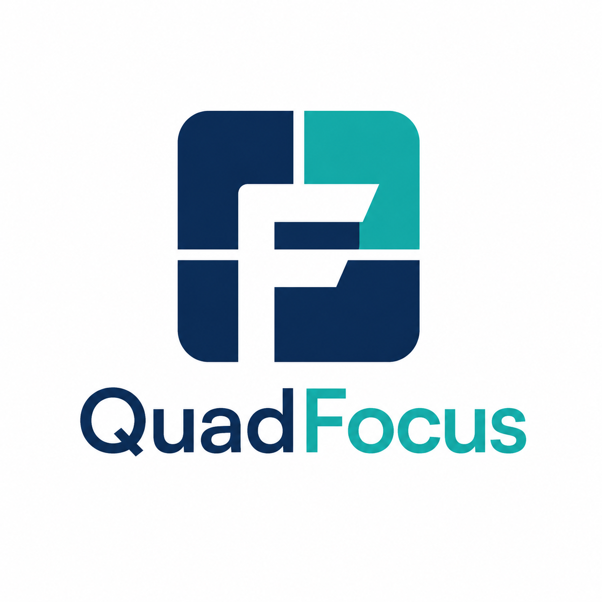

<p align="center">
  
</p>

<h1 align="center">QuadFocus</h1>

<p align="center"><strong>四象限任务管理 × 锁屏进展记录</strong>，Windows 桌面原生工具。</p>

<p align="center">
  
  
  
</p>

---

## 简介

QuadFocus 是一款轻量级 Windows 桌面效率工具，帮助多线程工作的人理清任务优先级，并在每次锁屏时自然地完成进展记录。

核心理念：**主动提醒不打断工作流，在你锁屏的瞬间完成当日复盘。**

---

## 功能特性

### 四象限任务板
- **主线工作** · **支线项目** · **有意思的项目** · **截止期限（Deadline）**
- 支持三层嵌套（项目 → 阶段 → 子任务）
- 每个任务可设置状态（TODO / ACTIVE / PAUSE / DONE）、截止日期、描述
- 任务完成后自动归档，支持一键复原到任意象限
- **象限面板大小可拖拽调整**，支持 1/3 · 1/2 · 2/3 三个吸附点
- **拖拽调整任务顺序**：顶层任务可跨象限拖拽，子任务在同一父级内排序

### 任务内联日志
- 每个任务均可展开日志区，**自动添加记录时间戳**
- 支持多条进展记录，按时间顺序保存
- 锁屏弹窗和主界面均可查看、追加日志

### 锁屏进展拦截
- 按 `Win+L` 触发进度更新弹窗，完成记录后才真正锁屏
- 支持跳过（不记录直接锁屏）或取消（保持解锁状态）

### 解锁自动打开
- 每天第一次解锁时，自动弹出 QuadFocus 主界面，提醒规划当日任务

### 任务搜索
- 标题栏内置搜索框（`Ctrl+K` 呼出），支持按名称快速定位任意象限的任务

### 归档系统
- 完成的任务自动移入归档，保留标题、描述、截止日期、进展日志
- 可复原归档任务到任意象限，继续追踪

### 数据存储
- 所有数据存为本地 JSON 文件，路径自定义（支持 OneDrive 同步）
- 格式化 JSON，便于备份和手动编辑

---

## 系统要求

| 项目 | 要求 |
|------|------|
| 操作系统 | Windows 10 / 11（64 位） |
| WebView2 运行时 | 通常已随 Edge 预装；如缺失请访问 [Microsoft 下载页](https://developer.microsoft.com/en-us/microsoft-edge/webview2/) |
| 权限 | 需要管理员权限（用于拦截 Win+L） |

---

## 安装方法

1. 前往 [Releases](../../releases) 页面，下载最新版 `QuadFocus-v*.zip`
2. 解压到任意目录（建议 `C:\Program Files\QuadFocus\` 或 `%LOCALAPPDATA%\QuadFocus\`）
3. 右键 `QuadFocus.exe` → **以管理员身份运行**
4. 首次启动将引导配置数据文件路径和开机自启

> **提示**：若需长期使用，建议在设置中开启「开机自启」，程序将自动以管理员身份启动。

---

## 使用说明

### 快捷键

| 操作 | 方式 |
|------|------|
| 搜索任务 | `Ctrl+K`（标题栏搜索框） |
| 锁屏并记录进展 | `Win+L` |
| 新建任务 | `N`（标题栏「+ 新建」按钮） |
| 切换任务状态 | 点击状态徽标（TODO → ACTIVE → PAUSE → DONE） |
| 编辑任务标题 | 点击标题文字，回车保存，`Esc` 取消 |
| 添加任务描述 | 悬停任务 → 点击描述占位符，`Shift+Enter` 换行 |

### 主界面操作

- **添加任务**：点击象限底部「+ 添加项目」，或按 `N`
- **添加子任务**：悬停任务 → 点击「+ 子项」（最多三层）
- **设置截止日期**：悬停任务 → 点击「+ 日期」（格式：MM-DD）
- **查看进展日志**：悬停任务 → 点击「日志 N」
- **调整象限大小**：拖拽中央分隔线，吸附到 1/3 · 1/2 · 2/3 处
- **调整任务顺序**：拖拽任务左侧 ⠿ 图标
- **归档查看**：标题栏「归档」按钮

### 锁屏弹窗

按 `Win+L` 后出现四象限进度更新界面：
- 为进行中的任务追加日志、更新状态
- **保存并锁定**：保存记录后锁屏
- **跳过**：不记录，直接锁屏
- **✕ 取消锁屏**：关闭弹窗，继续工作

---

## 版本历史

### v2.0.0
- **Light Notebook 界面重设计**：暖纸色调配色、Source Serif 4 字体
- 每个任务新增内联日志区，支持自动时间戳
- 标题栏内置搜索（`Ctrl+K`）、日期、周数显示
- 象限面板可拖拽调整大小，支持 1/3 · 1/2 · 2/3 吸附
- 修复 contentEditable 光标定位与文本复制问题
- 修复 Deadline 日期选择器在中文系统显示异常问题
- SVG 任务状态图标与象限统计徽标

### v1.1.x
- 新增象限面板拖拽调整大小（吸附点）
- 顶层任务跨象限拖拽、子任务同级内排序
- 浮动输入框优化（在点击位置就近弹出）
- 自定义标题栏，移除系统边框
- 添加 LICENSE 文件（仅限个人非商业使用）

### v1.0.0
- 四象限任务管理（三层嵌套，状态 / 截止日期 / 描述）
- Win+L 锁屏拦截与进展记录
- 解锁自动弹出
- 任务归档与复原
- 浮动日期选择器
- 进展日志查看

---

## 数据说明

用户数据存储在首次配置时指定的 JSON 文件中，格式如下：

```json
{
  "lastOpenDate": "2026-05-20",
  "archive": [],
  "quadrants": {
    "main":     { "name": "主线工作",     "items": [] },
    "side":     { "name": "支线项目",     "items": [] },
    "fun":      { "name": "有意思的项目", "items": [] },
    "deadline": { "name": "截止期限",     "standalone": [] }
  }
}
```

建议将数据文件存放在 OneDrive / Dropbox 等同步目录实现多机同步。

---

*QuadFocus — 让每次锁屏都不虚度*
